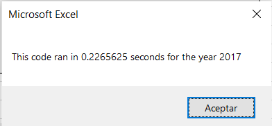
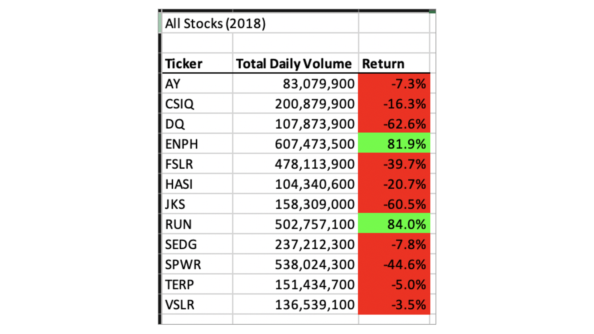

# Report Challenge 2: Code Comparison Analysis

## Overview of Project: Explain 
 

The purpose of this analysis is to analyse and compare the refactored code and original codeVBA, using VBA program, from a dataset of 3000 elements of the stock market in the US. The objective of the refactored code is to enhance and optimize computational performance in order to reduce times and to expand the dataset with more information. It is found that looping or making iterative processes unnecessary times can increase computational times enormously, thus the refactored code eradicates this problem by looping only one time and reducing computational time.

## Introduction:

Refactoring is a very important practice of the development of a code. Its purpose is to make an enhanced and more efficient code or algorithm. This, by optimizing computer allocation and memory (reducing variables or specifying their type) or improving the logic of the code, in order to make a process run with less procedures. In addition, this practice aides users to read the script more easily, thus allowing them to understand or modify it. Usually, refactoring is the next step after a code is running because the original algorithm, most times, is not the most efficient one to accomplish a task. In the following paragraphs, the results will be shown first and then the analysis.

## Results and Analysis:

### Pseudo Code:

Before analyzing the original and refactored code it is important to show their respectives pseudo codes, due to the fact that they show the difference of the computational process of the final output. It can be seen in the table below that the refactored pseudo code has more steps, although it does not modify the final output of the code, that is to say, the external behavior (see computational performance and final output below) it has ameliorated the internal structure due to the fact that, even though it is more extensive, it has improved the code's readability and has reduced the complexity to facilitate the maintainability of the source code. In addition, the computational logic has improved since the arrays are created to allocate in each category (start price, end price and total volume) the results obtained for each company (The companies names are written as strings, see the code below) and then print them all in one cycle, as the computer distinguishes each component within the arrays, instead of iterating several times the information of only one company, then print it, and then repeating the same process, with the same information, with the same variable, but with another company. This contrast can bee seen between the original pseudo code and the refactored pseudo code. This, allows to enhance computational performance and save resources due to the fact that each array is specified (long and single, see step 8) and it only takes one run to save all this information and print it. It is important to note, that even though the code is changed, it has not affected the main functionality of the code, so the changes being made are just to make the code more efficient and easier to understand. 

 Pseudo Code (Original)|Pseudo Code (Refactored)
 -----------------------|---------------------------
1.Format the output sheet on the "All Stocks Analysis" worksheet.  | 1. Format the output sheet on the "All Stocks Analysis" worksheet.
2.Initialize an array of all tickers.                              | 2. Initialize an array of all tickers.
3.Prepare for the analysis of tickers.                             | 3.  for the analysis of tickers.
4.Initialize variables for the starting price and ending price.    | 4. Activate the data worksheet.
5.Activate the data worksheet.                                     | 5. Find the number of rows to loop over.
6.Find the number of rows to loop over.                            | 6. create ticker index and set it to zero
7.Loop through the tickers.                                        | 7. Create a variable, which will be called tickerindex and set it equal to zero before the iteration over all the rows.  This tickerIndex is used to access the correct index across the four arrays used, which will be created in the following step.
8.Loop through rows in the data.                                   | 8. Create three output arrays: tickerVolumes, tickerStartingPrices, and tickerEndingPrices:  * The tickerVolumes array should be a Long data type. * The tickerStartingPrices and tickerEndingPrices arrays should be a Single data type..
9.Find the total volume for the current ticker.                    | 9. Create a for loop to initialize the tickerVolumes to zero.
10.Find the starting price for the current ticker.                 | 10. Create a for loop that will loop over all the rows in the spreadsheet.
11.Find the ending price for the current ticker.                   | 11. Inside the for loop in Step 10, an algorithm that increases the current tickerVolumes should be insert (stock ticker volume)  variable and adds the ticker volume for the current stock ticker.The tickerIndex variable it is used as the index.
12.Output the data for the current ticker                          | 12. Writing an if-then statement it has to be checked if the current row is the first row with the selected tickerIndex. If it is, then it is assigned the current starting price to the tickerStartingPrices variable..
13..| 13. Write an if-then statement to check if the current row is the last row with the selected tickerIndex.  If it is, then assign the current closing price to the tickerEndingPrices variable.
14.. | 14. Write a script that increases the tickerIndex if the next row’s ticker doesn’t match the previous row’s ticker.
15..|15.  Use a for loop to loop through your arrays (tickers, tickerVolumes, tickerStartingPrices, and tickerEndingPrices) to output the “Ticker,” “Total Daily Volume,” and “Return” columns in your spreadsheet.
16..|16. Finally, run the code, then confirm that your final output is the same, but faster. 

### Codes:

Below the original code and the refactored code are shown. It can be seen that, with the purpose to reduce the computational time and resources occupied, the refactored code uses four arrays (tickers, tickerVolumes, tickerStartingPrices, and tickerEndingPrices: as String type, Long type, Single type and Single type, respectively) which is not the case for the original code, since it has 1 array. Although it may seem that the latest script uses less memory, it is not true since within its body we can see that the ticker=tickers(i) variable is not specified, thus the computer uses every type of variable in order to avoid mistakes when running, therefore it can be concluded the following. Firstly, by creating 4 arrays, it reduces allocation memory as the type of the arrays are specified, so the computer does not need to use all type of arrays, only the ones used. For instance, declaring a 9 element, but not specified type of, array consumes 176 bytes in contrast to a 9 element, double type of, array which consumes 22 bytes. This shows clearly a reduction of memory, thus improving computational time. 

Original Code|Refactored Code
-------------|-----------------
 | 

Secondly, as seen in the image below, by creating the ticker_index variable, and setting it equal to zero, it can be accessed to each element in the, previously mentioned, arrays. This is done once the if-then statement, within the for loop (see code), completes the condition to assign the current closing price of the last row with the selected ticker. As this condition is completed, the algorithm increases the ticker_index variable by one, thus as the iteration process continues for the n-th time the: tickerVolumens(ticker_index), tickerStartingPrices(ticker_index) and tickerEndingPrices(ticker_index) update their arguments, with the increment given before, and access to the next element in the arrays, resulting to save the correct information for each ticker with less computational time, since with one for loop, the computer can allocate correctly the corresponding information. 

. | .
---|---
| 

Thirdly, it can be seen that modifying the for loop structure(see codes above), reduces enormously computational time (see computational performance and final output below) as it is explained in the following sentences: In the original script, there is a nested for loop: the main one runs 12 times and the nested one runs for 3,012 times (it starts at i=2 and finishes at rowend=3,013) that is to say, the iterative process is repeated for 12*3012 = 36,144 times in order to save the correct information of the given data. While this is the case for the original script, the refactored code has two non-nested for loops: the first is to initialize all the elements in the tickerVolumes array to zero, thus it will run for 12, times. This, with the purpose that as the following for loop begins, all the elements within the tickerVolume-array will be zero, in such way, that once the conditions, when the ticker_index variable is zero, within the loop are completed, the ticker_index will update the arguments of the variables and move on to next element inside the: tickerVolumes-array, tickerStartingPrices-array, and tickerEndingPrices-array, resulting to allocate in one run all the information correctly, that is to say, the algorithm will run for 12 + 3,012 = 3,024 times, which is an unbelievable reduction in contrast to the original code. In other words, the iterative process reduces by almost 12 times, resulting in a reduction of time as seen below. It is shown that the change in the for loop structure maximizes time improvement, dropping for 1.5 seconds to 0.2. This means that the refactored code is 5 times faster than the original script, which is a computational performance improvement of 500%. 

Computational Performance Original Code| Computational Performance Refactored Code
---------------------------------------|-------------------------------------------
| 

| 

Although refactoring a code always makes a code more efficient, and it will make a code more readable and cleaner, usually it is much harder to make it possible, due to the fact that most codes are incredibly long. This, makes the task of refactoring a very complex practice, so it is important to analyze how much time, effort and if it is worth to change the original code. For instance, if a code runs good enough, but not as fast as it could be, but serves its purpose, it is not worth making a mayor change to make more efficient the code. Finally, the output is shown below, it is the same for both codes, so the refactoring practice was more efficient

Final Output For 2017|Final Output For 2018
---------------------|----------------------
| 

## Summary: 
What are the advantages or disadvantages of refactoring code?
How do these pros and cons apply to refactoring the original VBA script?

Pros and Cons of Refactoring Code
Refactoring is very important process after a code is finished, it is a multi objective problem since it seeks for code  readability, that is, a more cleaner and organized code, change structural "garbage" and modify it to make the computational performance faster. The outcome of refactoring allows newer programmers or software developers to understand the algorithm, so they can make contributions in order to make it better. Even though, its true that refactoring improves the code and optimizes it, most of the occasions it implies a tremendous amount of time, work and effort, due to the difficulty of modifying long and complex structures without changing the final output, si it is essential to analyse the advantages of refactoring the current code. 

Along this project, refactoring was a major part of work, the computational performance allowed to reduce the time up to 500%, which will let to use more data and have a better computational efficiency,in this case the pros outweighed the cons, since it was not that much time to modify the structure. 

